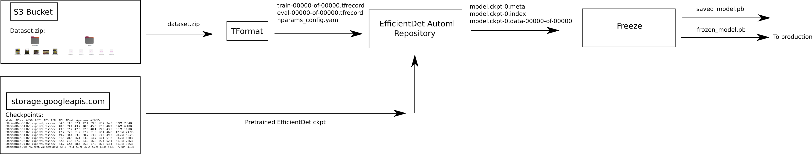
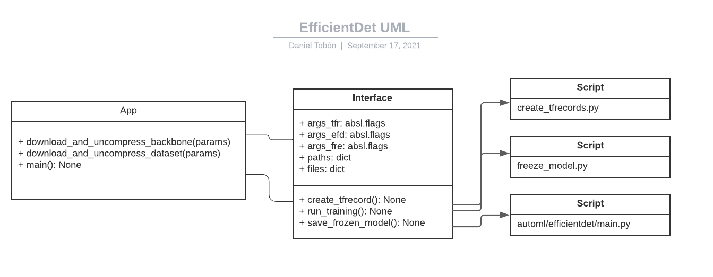

# Efficientdet Repositorio Refactorizado
Repositorio refactorizado para el trabajo y desarrollo de una CNN basada de detección y clasificación de objetos en el modelo del EfficientDet de Google: [efficientdet-google](https://github.com/google/automl)

## Descripción
Este proyecto se basa en un patrón de diseño estructural Facade que permite ocultar la complejidad interna del proyecto [efficientdet-google](https://github.com/google/automl) y expone una interfaz simplificada de uso para el pipeline de entrenamiento, evaluación y manejo de datasets.

Este proyecto fué probado en Tensorflow 2.5 y Python 3.8.10, ubuntu focal 20.04 con kernel 5.11.0-1020-gcp.

Drivers: CUDA 11.2 y CuDNN 8.1

Tensorflow 2 requiere CPU con soporte AVX

Espeficaciones de máquina en Cloud Compute Engine:

```
VM: efficientdet-training1

Machine type
a2-highgpu-1g (12 vCPUs, 85 GB memory)

CPU platform
Intel Cascade Lake

GPUs
1 x NVIDIA Tesla A100

Zone
us-central1-a

Firewalls
Allow HTTP traffic
Allow HTTPS traffic

Boot disk 
Image: ubuntu-2004-focal-v20210908 	
size: 100GB
type: Standard persistent disk
	
Additional disks
None

Local disks
None

Preserved state size
0 GB
```

**Nota:**
Se recomienda el uso de entorno virtual conda/virtualenv para el manejo de la instalación de paquetes. Alternativamente se puede configurar una imagen de docker.


# Pipeline



# PIP package
Para compilar el paquete pip se puede ejecutar el siguiente comando:

`python setup.py sdist`

El comando anterior va a crear un folder `dist` con un archivo `.tar` que puede ser instalado con el comando:

```
pip install archivo.tar
e.g.
pip install efficientdet_aituring-0.0.1.tar
```

# TODO
- Hace falta desarrollar manejo de excepciones, ya sea por parametro mal proporcionado o no encontrado
- Revisar parametros que no son seteables por line de commando: `gcp_project`, `strategy`
- Paralelizar la creación de shards/tfrecords


# Repositorio Estado Actual
- Actualmente, este repositorio permite la ejecución de un entrenamiento personalizado con tfrecords de validación. Se puede evaluar el modelo seleccionando el modo `traineval`. También, es posible visualizar el progreso de entrenamiento, metricas y accuracy en tensorboard. 


## Getting started
Se debe clonar el repositorio de manera **recursiva** para descargar los archivos correspondientes al submodulo [efficientdet-google-fork-version](https://git-codecommit.us-east-1.amazonaws.com/v1/repos/automl)
```
git clone --recursive https://git-codecommit.us-east-1.amazonaws.com/v1/repos/automl_v2
```

## Requisitos

### Windows
- Microsoft C++ Build Tools: [link here](https://visualstudio.microsoft.com/visual-cpp-build-tools)
- wget: [link here](https://eternallybored.org/misc/wget/)
- Agregar a las variables de entorno (opcional) (si se usa miniconda3):

	- `C:\Users\USER-NAME\miniconda3\Scripts`
	- `C:\Users\USER-NAME\miniconda3\Library\bin`

**Note:**
Se debe agregar el path del folder en donde está *wget* a las variables de entorno de windows


### Linux
- gcc >= 9.3.0
- python3.8.10:
```
sudo apt-get install python3.8.10
```
- python3.8-dev:
```
sudo apt-get install python3.8-dev
```
- alias para usar python3.8 en lugar de python 3.6 (ubuntu 16.04). En ubuntu focal 20.04 no es necesario este paso.
```
Go to .bashrc
alias python3=python3.8
alias pip3="python3.8 -m pip"
source .bashrc

Go to .profile
export PATH=$PATH:/home/user_name/.local/bin
source .profile
```
- install virtualenv (opcional):
```
pip3 install virtualenv
```

## Instalación
Se recomienda el uso de un entorno aislado para la instalación de paquetes. Para este repositorio se utilizó [miniconda/virtualenv](https://docs.conda.io/en/latest/miniconda.html)

```
conda config --set auto_activate_base false
conda config --set env_prompt '({name})
```

### Instalación con conda
```
conda create --prefix=conda-env python=3.8.10
conda activate conda-env/
conda install tensorflow=2.5
conda install tensorflow-model-optimization=0.6 -c hcc
conda install lxml=4.6 -c conda-forge
conda install pycocotools=2.0.2
conda install opencv=4.5 -c conda-forge
conda install pyyaml=5.4 -c conda-forge
```

### Instalación con conda + PIP
```
conda create --prefix=conda-env python=3.8.10
conda activate conda-env/
pip install -r requirements.txt
```
**Nota:**
Conda también permite la carga de paquetes desde un archivo de requerimientos utilizando el comando:

`conda install --file requirements.txt`

### Instalación Docker
```
docker build -t automl_v2:1.0 .

From host env, run:
	mkdir -p /some/folder
	chown -R 1000:1000 /some/folder
	docker run -v /path/to/host/folder:/path/to/container/workspace [your_container]

	docker run --rm -v /home/daniel_tobon/output:/home/aiteam/workspace --shm-size=8g --ulimit memlock=-1 --ulimit stack=67108864 --gpus all automl_v2:1.0 @params.config --mode=traineval
```

### Instalación con virtualenv
1. `virtualenv -p python3 venv-name`
2. `pip install -r requirements.txt`

Donde python3 es el interpreter a utilizar. Para utilizar una version especifica de python, se debe instalar el interpreter de esa versión.


## Parametros
Este repositorio admite parametros de 3 formas:

1. parametros por linea de comando:
```
python3 main.py 
--mode=traineval 
--train_file_pattern=/path/to/train.tfrecord
--val_file_pattern=/path/to/eval.tfrecord
--model_name=efficientdet-d0 
--model_dir=/path/to/output/folder 
--pretrained_ckpt=/path/to/downloaded/backbone/checkpoint
--hparams=/path/to/hparams_config.yaml
--batch_size=8
--num_epochs=20 
--eval_samples=1024
--num_examples_per_epoch=10
--train_valid_split=0.7
```
**Nota:**
Para una lista completa de argumentos por linea de comando
```
python3 main.py [-h/--help]    version corta
python3 main.py [--helpfull]   version completa
```
2. parametros por archivo de configuración:

Esta opción permite la carga de argumentos desde un archivo externo. No hay preferencia en el tipo de archivo, puede ser `.txt`, `.config`, `.ini`, etc. La estructura del archivo es la siguiente:
```
--url_dataset=https://datasets-aiteam.s3.amazonaws.com/DATASET-40-FOTOS.zip
--backbone_ref=efficientdet-d0
--num_epochs=15
--num_examples_per_epoch=100
--batch_size=6
--train_valid_split=0.7
--eval_samples=1024
--profile
```

Para cargar el archivo se indica con una `@` el nombre del archivo
```
python3 main.py @[archivo de configuración]
e.g.
python3 main.py @params.config
```

3. parametros por variables de entorno: Actualmente, los unicos parametros que pueden ser asignados por variables de entorno son los siguientes.

```
'url_dataset'
'backbone_ref'
'num_epochs'
'batch_size'
'model_ckpts' (opcional)
'num_examples_per_epoch'
```


## Docs
La definición de cada función se encuentra en el siguiente docs:

- [main](./efficientdet_aituring/docs/main_principal.html)
- [main_automl_efficientdet](./efficientdet_aituring/docs/main_automl_efficientdet.html)
- [command_interface](./efficientdet_aituring/docs/command_interface.html)
- [create_tfrecords](./efficientdet_aituring/docs/create_tfrecords.html)
- [freeze_model](./efficientdet_aituring/docs/freeze_model.html)


## Test
Los siguientes ejemplos muestran las 3 formas de ejecutar el pipeline.
```
Training with command line parameters
-------
python3 main.py \
--mode=traineval
--url_dataset=https://datasets-aiteam.s3.amazonaws.com/DATASET-5-FOTOS.zip \
--backbone_ref=efficientdet-d0 \
--num_examples_per_epoch=100
--num_epochs=20 \
--batch_size=8 \
--train_valid_split=0.7


Training with environment variables    
-------
export url_dataset=https://datasets-aiteam.s3.amazonaws.com/DATASET-5-FOTOS.zip
export batch_size=8
export backbone_ref=efficientdet-d0
export num_epochs=20
export model_ckpts=/path/to/save/model (opcional)
python3 main.py 


Training with configuration file    
-------
python3 main.py @params.config --mode=traineval
```

## Vertex
Existe una imagen de docker personalizada para vertex con la versión refactorizada de este repositorio. Se encuentra almacenada en [Artifact Registry](https://console.cloud.google.com/artifacts?project=aigroup-325213) y utiliza el bucket [efficientdet-training1-bucket](https://console.cloud.google.com/storage?project=aigroup-325213) en google storage. 

Parametros para vertex training

```
--url_dataset=https://datasets-aiteam.s3.amazonaws.com/DATASET-40-FOTOS.zip
--backbone_ref=efficientdet-d1
--model_ckpts=gs://efficientdet-training1-bucket/prueba3-vertex-output/
--train_valid_split=0.7
--mode=traineval 
--model_name=efficientdet-d1
--batch_size=8
--num_epochs=5 
--eval_samples=20
--num_examples_per_epoch=10
```

## TFRecords
Este script convierte un directorio de imagénes (dataset) en el formato de AITuring (PASCAL VOC) a tfrecord (formato que recibe la red neuronal). El nuevo submodulo de `automl/efficientdet` no tiene como argumento `data_augmentation`. En su lugar, tiene un argumento de `autoaugment_policy` que se puede setear a `randaug`, `v0`, entre otros. 
```
python3 /tfrmod/create_tfrecords.py \
--data_dir=/home/daniel_tobon/dataset \
--output_path=/home/daniel_tobon/workspace/tfrecords/ \
--autoaugment_policy=v0  \
--train_valid_split=1.0
```


## Train
Este modo permite ejecutar un entrenamiento personalizado. Se require los tfrecord de entrenamiento generados a partir del dataset. Por favor, remitirse a la sección `Training with command line parameters` para una lista completa de argumentos.  
```
python3 main.py \
--mode=train \
--train_file_pattern=/path/to/train.tfrecord \
--model_name=efficientdet-d0 \
--model_dir=/path/to/output/folder \
--pretrained_ckpt=/path/to/downloaded/backbone/checkpoint \
--hparams=/path/to/hparams_config.yaml \
--batch_size=8 \
--num_epochs=20 \
--num_examples_per_epoch=10 \
--train_valid_split=1.0
```


## Train and Eval
Este modo permite ejecutar un entrenamiento personalizado con validación. Adicional a los tfrecord de entrenamiento, se require el tfrecord de validación. Por favor, remitirse a la sección `Training with command line parameters` para una lista completa de argumentos.  
```
python3 main.py \
--mode=traineval \
--train_file_pattern=/path/to/train.tfrecord \
--val_file_pattern=/path/to/eval.tfrecord \
--model_name=efficientdet-d0 \
--model_dir=/path/to/output/folder \
--pretrained_ckpt=/path/to/downloaded/backbone/checkpoint \
--hparams=/path/to/hparams_config.yaml \
--batch_size=8 \
--num_epochs=20 \
--eval_samples=1024 \
--num_examples_per_epoch=10 \
--train_valid_split=0.7
```


## Eval
Este modo permite ejecutar una validación en un conjunto de tfrecords. 
```
python3 /tf2/eval.py \
--val_file_pattern=/path/to/eval.tfrecord \
--model_name=efficientdet-d0 \
--model_dir=${CKPT_PATH} \
--hparams=/path/to/hparams_config.yaml \
--batch_size=8 \
--eval_samples=1024
```


## Frozen model
Este modo permite exportar un modelo entrenado a formato saved_model.pb y frozen_model.pb. El froze_model.pb es el modelo que se entrega a producción.
```
python3 freeze_model.py \ 
--path_ckpt=${CKPT_PATH} \
--path_yaml=/path/to/hparams_config.yaml \
--path_output=/path/to/output/folder \
--model_name=$backbone_ref
```

Tambien se puede crear el frozen model con el modulo `inspector.py` en `automl/efficientdet/tf2/inspector.py`.

```
python inspector.py \
--mode=export \
--model_name=efficientdet-d0 \
--model_dir=${CKPT_PATH} \
--saved_model_dir=/path/to/output/folder \
--hparams=path/to/hparams_config.yaml
```


## Inference
Este modulo permite realizar inferencia a partir de modelo entrenado. Al igual que en el punto anterior, el modulo `inspector.py` en `automl/efficientdet/tf2/inspector.py` realiza la inferencia a un imagen de entrada.

```
inference para 1 imagen  
-------
python inspector.py \
--mode=infer \
--model_name=efficientdet-d0 \
--saved_model_dir=${CKPT_PATH} \
--hparams=path/to/hparams_config.yaml \
--input_image=img.png \
--output_image_dir=/path/to/output/folder


inference con frozen_model.pb  
-------
python inspector.py \
--mode=infer \
--model_name=efficientdet-d0 \
--saved_model_dir=${CKPT_PATH}/efficientdet-d0_frozen.pb \
--hparams=path/to/hparams_config.yaml \
--input_image=img.png \
--output_image_dir=/path/to/output/folder


inference con cloud function  
-------
coming soon
```


## Inspect TFRecords
Existe un modulo para la inspeccion de tfrecords. La idea de este modulo es determinar si el tfrecord está corrupto o mal configurado.

To visualize training tfrecords with input dataloader use.

```
python dataset/inspect_tfrecords.py --file_pattern dataset/sample.record\ 
--model_name "efficientdet-d0" --samples 10\ 
--save_samples_dir train_samples/  -hparams="label_map={1:'label1'}, autoaugmentation_policy=v3"
```

To visualize evaluation tfrecords use.

```
python dataset/inspect_tfrecords.py --file_pattern dataset/sample.record\ 
--model_name "efficientdet-d0" --samples 10\ 
--save_samples_dir train_samples/  -eval\
-hparams="label_map={1:'label1'}"
```

samples: random samples to visualize.
model_name: model name will be used to get image_size.
save_samples_dir: save dir.
eval: flag for eval data.


## troubleshoot
En este sección se presentan algunos errores de instalación y/o ejecución del pipeline y su correspondiente solución.
```
Error: pip install tensorflow cannot find file called xxx.h
Solution: Follow the instructions to update your registry for MAX_PATH, changing it from 0 to 1 in Windows.
Your administrator will need to activate the “Enable Win32 long paths” group policy, or set LongPathsEnabled to 1 in the registry key HKEY_LOCAL_MACHINE\SYSTEM\CurrentControlSet\Control\FileSystem. 
https://docs.python.org/3/using/windows.html

Error: wget is not recognized as an internal or external command
Solution: Download and install wget on Windows

Error: Illegal instruction (core dumped) after running import tensorflow
Solution: tensorflow 2 only works on a CPU with AVX support, you will need to use tensorflow conda instead of pip or compile your own from source code with AVX support disabled

Error: no module xxx found
Solution: pip install xxx

Error: ParserError the splatting operator '@' cannot be used to reference variables in an expression. '@params' can be used only as an argument to a command.
Solution: quote the whole argument e.g python3 main.py '@params.config'

Error: tee is not recognized as an internal or external command
Solution: download and install tee on windows, https://sourceforge.net/projects/unxutils/

Error: ValueError: numpy.ndarray size changed, may indicate binary incompatibility. Expected 88 from C header, got 80 from PyObject
Solution: pip uninstall pycocotools
          pip install pycocotools

Error: NameError: name 'unicode'
Solution: pip install 'git+https://github.com/cocodataset/cocoapi.git#subdirectory=PythonAPI'
https://github.com/google/automl/issues/178

Error: Invalid argument: assertion failed: [ERROR: please increase config.max_instances_per_image] [Condition x < y did not hold element-wise:] [x (parser/strided_slice_17:0) = ] [152] [y (parser/assert_less/y:0) = ] [100]
Solution: set max_instances_per_image: 200 or more in hparams_config.py

ERROR: raise ValueError('Expect x to be a non-empty array or dataset.')
Solution: This Error is caused by the size of training data is smaller than batch_size which is not allowed. Or the num_examples_per_epoch is too small
```